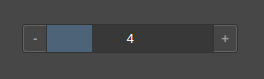

# Input range number react component

* Just click by element for use it like usual input number
* Or hold and drag for use it like range input

# Screenshot

### Base work you can [see there](https://0zlgq.csb.app/)